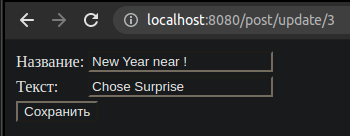

[](https://travis-ci.org/KirillDan/job4j_forum)
[](https://codecov.io/gh/KirillDan/job4j_forum)
<br/>
# Проект "Форум".

### О проекте
Ссылка на проект Heroku - https://frozen-peak-80021.herokuapp.com/.

Использованные технологии в проекте:

- клиентская часть: HTML, CSS, JS.
- серверная часть: Spring Boot, Spring Security, Spring Data, Junit, liquibase

### Сборка

Необходимо создать базу данных forum в СУБД PostgreSQL и указать параметры в файле src/main/resources/application-dev.properties:
```
spring.datasource.url=jdbc:postgresql://127.0.0.1:5432/forum
spring.datasource.username=postgres
spring.datasource.password=123
```

Cобрать maven проект: mvn package

Запуск: java -jar target/forum-1.jar

### Использование

* Регистрация


* Вход


* Главная страница


* Создание поста


* Страница поста


* Страница Изменения поста



* logout


### Контакты

* Skype: live:.cid.8f17c3f8d147e77

